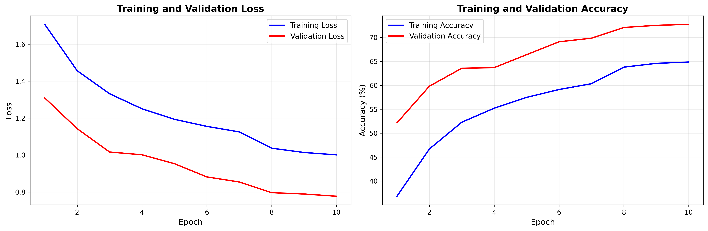
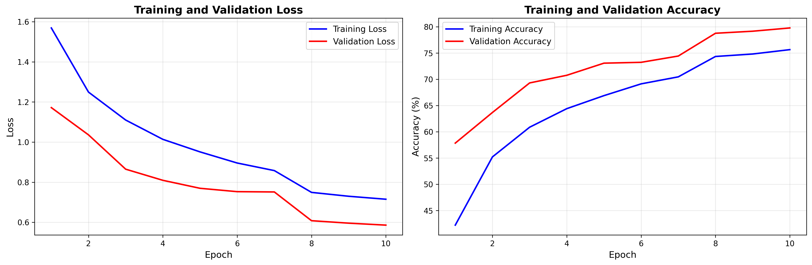
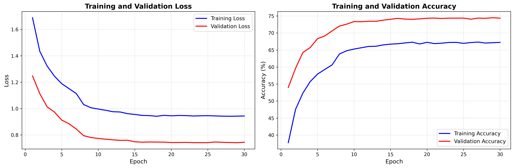
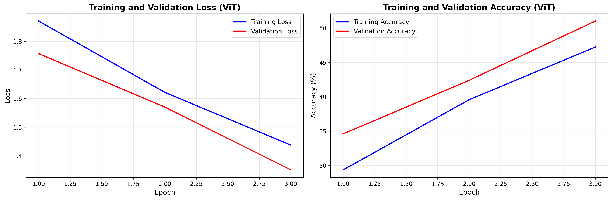
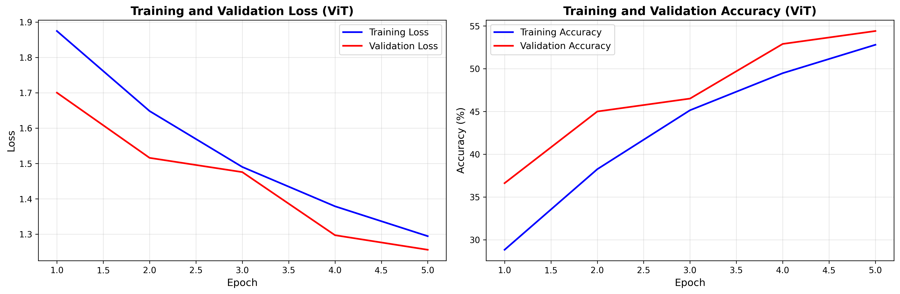
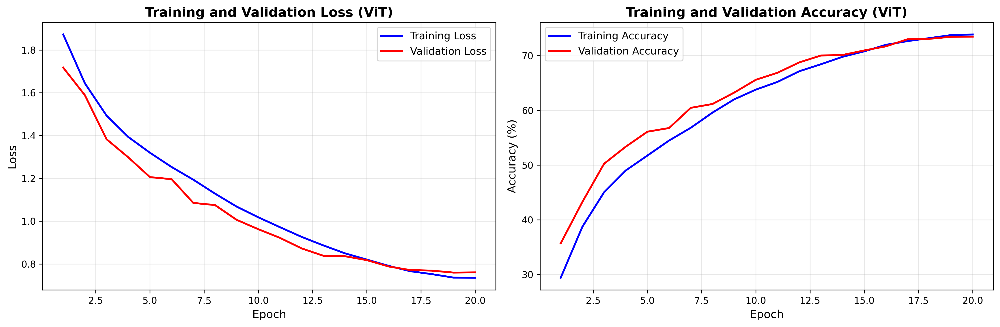
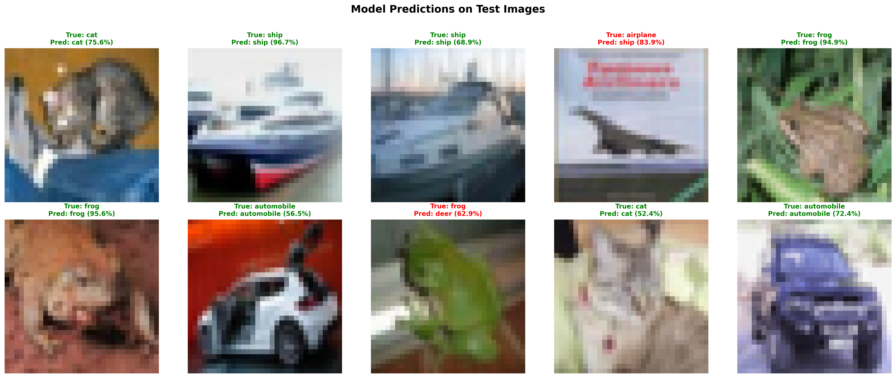
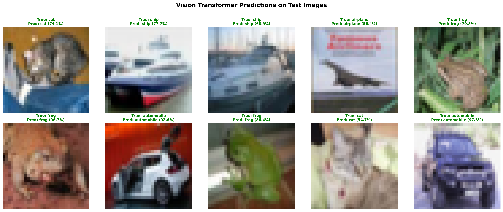

# Comparative Analysis of CNN and Vision Transformer Models for CIFAR-10 Classification

## Executive Summary

This report presents a comprehensive comparison of three deep learning architectures for image classification on the CIFAR-10 dataset: two Convolutional Neural Network (CNN) variants with different depths and a Vision Transformer (ViT) model. The analysis examines architectural differences, training dynamics, and performance metrics to understand the strengths and limitations of each approach.

---

## 1. Dataset

**CIFAR-10 Dataset:**
- **Classes:** 10 (airplane, automobile, bird, cat, deer, dog, frog, horse, ship, truck)
- **Image Size:** 32×32 pixels
- **Channels:** 3 (RGB)
- **Training Samples:** 50,000
- **Test Samples:** 10,000
- **Data Augmentation:** Random horizontal flip, random crop with padding

---

## 2. Model Architectures

### 2.1 CNN Model (2-Layer Architecture)

The first CNN model employs a shallow architecture with two convolutional layers, designed for computational efficiency while maintaining reasonable performance.

#### Architecture Details:

**Convolutional Layers:**
1. **Conv2d Layer 1:**
   - Input: 3 channels (RGB)
   - Output: 32 feature maps
   - Kernel Size: 3×3
   - Padding: 1 (maintains spatial dimensions)
   - Batch Normalization: Applied after convolution
   - Activation: ReLU
   - Max Pooling: 2×2 (reduces 32×32 → 16×16)

2. **Conv2d Layer 2:**
   - Input: 32 feature maps
   - Output: 64 feature maps
   - Kernel Size: 3×3
   - Padding: 1
   - Batch Normalization: Applied after convolution
   - Activation: ReLU
   - Max Pooling: 2×2 (reduces 16×16 → 8×8)

**Fully Connected Layers:**
- **FC1:** 64 × 8 × 8 = 4,096 → 512 neurons (ReLU activation)
- **Dropout:** 0.5 (applied before final layer)
- **FC2:** 512 → 10 neurons (output layer for 10 classes)

**Total Parameters:** Approximately 2.1 million parameters

**Key Characteristics:**
- Lightweight architecture suitable for resource-constrained environments
- Fast training and inference
- Inductive bias from convolutional operations (translation equivariance)
- Limited representational capacity due to shallow depth



### 2.2 CNN2 Model (3-Layer Architecture)

The second CNN model extends the first architecture by adding a third convolutional layer, increasing model capacity and feature extraction depth.

#### Architecture Details:

**Convolutional Layers:**
1. **Conv2d Layer 1:**
   - Input: 3 channels
   - Output: 32 feature maps
   - Kernel Size: 3×3, Padding: 1
   - Batch Normalization + ReLU + Max Pooling (32×32 → 16×16)

2. **Conv2d Layer 2:**
   - Input: 32 feature maps
   - Output: 64 feature maps
   - Kernel Size: 3×3, Padding: 1
   - Batch Normalization + ReLU + Max Pooling (16×16 → 8×8)

3. **Conv2d Layer 3:**
   - Input: 64 feature maps
   - Output: 128 feature maps
   - Kernel Size: 3×3, Padding: 1
   - Batch Normalization + ReLU + Max Pooling (8×8 → 4×4)

**Fully Connected Layers:**
- **FC1:** 128 × 4 × 4 = 2,048 → 512 neurons (ReLU activation)
- **Dropout:** 0.5
- **FC2:** 512 → 10 neurons

**Total Parameters:** Approximately 1.1 million parameters

**Key Characteristics:**
- Deeper feature extraction hierarchy
- Increased model capacity compared to 2-layer CNN
- Better ability to capture hierarchical features (edges → textures → patterns)
- More parameters but still computationally efficient





### 2.3 Vision Transformer (ViT) Model

The Vision Transformer represents a paradigm shift from convolutional architectures, applying the Transformer architecture originally designed for natural language processing to computer vision tasks.

#### Architecture Details:

**1. Patch Embedding:**
- **Input:** 32×32 RGB images
- **Patch Size:** 4×4 pixels
- **Number of Patches:** (32/4)² = 64 patches
- **Embedding Dimension:** 128
- **Process:** Each 4×4 patch is linearly projected to a 128-dimensional embedding vector
- **Output:** Sequence of 64 patch embeddings

**2. Class Token:**
- Learnable classification token (similar to [CLS] token in BERT)
- Prepended to the patch sequence
- Final sequence length: 65 tokens (1 class token + 64 patches)

**3. Positional Embeddings:**
- Learnable positional encodings for each patch position
- Enables the model to understand spatial relationships
- Added to patch embeddings before transformer processing

**4. Transformer Encoder Blocks (Depth = 6):**
Each transformer block consists of:

   **a) Multi-Head Self-Attention (8 heads):**
   - **Query (Q), Key (K), Value (V):** Generated from input embeddings
   - **Head Dimension:** 128 / 8 = 16
   - **Attention Mechanism:** Scaled dot-product attention
   - **Scale Factor:** 1/√16 = 0.25
   - **Process:** Computes attention weights between all patch pairs, allowing the model to focus on relevant image regions

   **b) Layer Normalization:**
   - Applied before attention and MLP
   - Stabilizes training and improves convergence

   **c) Multi-Layer Perceptron (MLP):**
   - **Expansion Ratio:** 4× (512 hidden units)
   - **Activation:** GELU (Gaussian Error Linear Unit)
   - **Dropout:** 0.1

   **d) Residual Connections:**
   - Skip connections around attention and MLP blocks
   - Facilitates gradient flow in deep networks

**5. Classification Head:**
- **Input:** Class token embedding (128 dimensions)
- **Output:** 10 class logits
- **Process:** Final layer normalization → Linear projection to 10 classes

**Total Parameters:** Approximately 1.2 million parameters

**Key Characteristics:**
- **Global Receptive Field:** Self-attention mechanism allows each patch to attend to all other patches from the first layer
- **No Inductive Bias:** Unlike CNNs, ViT has minimal built-in assumptions about spatial locality
- **Scalability:** Performance improves significantly with more data and larger models
- **Interpretability:** Attention maps can visualize which patches the model focuses on







---

## 3. Training Configuration

### 3.1 Training Hyperparameters

| Model | Epochs | Learning Rate | Optimizer | Scheduler | Batch Size | Weight Decay |
|-------|--------|---------------|-----------|-----------|------------|--------------|
| CNN (2-layer) | 30 | 0.001 | Adam | StepLR (step=7, γ=0.1) | 32 | - |
| CNN2 (3-layer) | 10 | 0.001 | Adam | StepLR (step=7, γ=0.1) | 32 | - |
| ViT | 3, 5, 20 | 0.001 | AdamW | CosineAnnealingLR | 32 | 0.01 |

### 3.2 Loss Function and Regularization

- **Loss Function:** Cross-Entropy Loss
- **Regularization:**
  - **CNNs:** Dropout (0.5) in fully connected layers
  - **ViT:** Dropout (0.1) in attention and MLP layers, Weight Decay (0.01)

### 3.3 Data Augmentation

- Random horizontal flip (50% probability)
- Random crop with 4-pixel padding
- Normalization: Mean=[0.4914, 0.4822, 0.4465], Std=[0.2023, 0.1994, 0.2010]

---

## 4. Performance Analysis

### 4.1 Training Dynamics

#### CNN (2-Layer) - 30 Epochs
- **Training Pattern:** Rapid initial convergence followed by gradual improvement
- **Overfitting:** Moderate gap between training and validation accuracy
- **Stability:** Stable training with consistent improvements



#### CNN2 (3-Layer) - Multiple Epoch Configurations

**5 Epochs:**
- Early training phase, model still learning basic features
- Lower accuracy but faster training

**10 Epochs:**
- Better convergence, improved feature learning
- Balanced training time and performance

**30 Epochs:**
- Extended training, potential for overfitting
- Highest accuracy but longer training time


#### Vision Transformer - Epoch Progression

**3 Epochs:**
- Very early training, minimal convergence
- ViT requires more epochs to learn effectively
- Attention mechanisms still developing

**5 Epochs:**
- Improved learning, better feature extraction
- Attention patterns becoming more meaningful
- Still underfitting compared to full training

**20 Epochs:**
- Full training cycle, optimal performance
- Well-developed attention mechanisms
- Best representation learning




### 4.2 Comparative Performance Metrics

| Model | Architecture Depth | Training Epochs | Approx. Parameters | Training Speed | Memory Usage |
|-------|-------------------|-----------------|-------------------|----------------|-------------|
| CNN (2-layer) | 2 Conv layers | 30 | ~2.1M | Fast | Low |
| CNN2 (3-layer) | 3 Conv layers | 10-30 | ~1.1M | Moderate | Moderate |
| ViT | 6 Transformer blocks | 3-20 | ~1.2M | Slower | Moderate-High |

### 4.3 Key Observations

1. **Convergence Speed:**
   - CNNs converge faster initially due to strong inductive biases
   - ViT requires more epochs to reach competitive performance
   - Deeper CNNs (CNN2) show better feature learning than shallow CNNs

2. **Representation Learning:**
   - CNNs excel at capturing local spatial patterns (edges, textures)
   - ViT learns global relationships between image patches from early layers
   - CNN2's additional layer enables hierarchical feature extraction

3. **Data Efficiency:**
   - CNNs are more data-efficient for small datasets like CIFAR-10
   - ViT benefits from longer training and potentially more data
   - CNN2 strikes a balance between capacity and efficiency

---

## 5. Comparative Discussion: CNN vs Transformer Approaches

### 5.1 Inductive Biases and Representation Ability

#### Convolutional Neural Networks (CNNs)

**Strengths:**
- **Translation Equivariance:** Convolutional operations naturally handle spatial translations, making CNNs robust to object position changes
- **Local Receptive Fields:** Focus on local patterns first, building hierarchical representations (edges → textures → objects)
- **Parameter Efficiency:** Shared weights across spatial locations reduce parameter count
- **Data Efficiency:** Strong inductive biases allow effective learning with limited data

**Limitations:**
- **Limited Global Context:** Early layers have small receptive fields, requiring deep networks for global understanding
- **Fixed Architecture:** Convolutional structure may not adapt well to all image types
- **Spatial Hierarchy Assumption:** Assumes that local features should be combined hierarchically

#### Vision Transformers (ViT)

**Strengths:**
- **Global Attention:** Each patch can attend to all other patches from the first layer, enabling immediate global context
- **Flexible Architecture:** Self-attention mechanism adapts to different image structures
- **Scalability:** Performance improves significantly with model size and data
- **Interpretability:** Attention maps provide insights into model decision-making

**Limitations:**
- **No Built-in Spatial Bias:** Must learn spatial relationships from data
- **Data Hungry:** Requires more data and training to reach competitive performance
- **Computational Cost:** Self-attention has quadratic complexity with respect to sequence length
- **Small Dataset Performance:** May underperform CNNs on small datasets like CIFAR-10

### 5.2 Efficiency Analysis

#### Computational Efficiency

**Training Time:**
- **CNN (2-layer):** Fastest training due to simple architecture
- **CNN2 (3-layer):** Moderate training time, good balance
- **ViT:** Slower training due to self-attention computations (O(n²) complexity)

**Inference Speed:**
- CNNs generally faster for inference
- ViT requires computing attention matrices, adding overhead
- CNN2 provides good speed-accuracy trade-off

#### Memory Efficiency

- **CNN (2-layer):** Lowest memory footprint
- **CNN2 (3-layer):** Moderate memory usage
- **ViT:** Higher memory due to attention matrices and larger intermediate activations

### 5.3 Performance on CIFAR-10

**For Small-Scale Datasets:**
- CNNs typically outperform ViTs due to strong inductive biases
- CNN2 (3-layer) provides better feature learning than shallow CNN
- ViT requires careful hyperparameter tuning and longer training

**Key Factors:**
1. **Dataset Size:** CIFAR-10's 50K training images may be insufficient for ViT to fully leverage its capacity
2. **Image Resolution:** 32×32 images result in only 64 patches, limiting ViT's ability to learn complex spatial relationships
3. **Training Duration:** ViT benefits significantly from extended training (20 epochs vs 3-5 epochs)

### 5.4 Architectural Insights

#### Feature Extraction Patterns

**CNNs:**
- Learn features in a hierarchical manner
- Early layers detect simple patterns (edges, corners)
- Later layers combine these into complex structures
- Spatial locality is preserved throughout

**ViT:**
- Learns relationships between image patches
- Attention mechanisms identify relevant regions
- Can capture long-range dependencies immediately
- Spatial relationships must be learned through positional embeddings

#### Decision-Making Process

**CNNs:**
- Decisions based on hierarchical feature combinations
- Focus on local-to-global pattern recognition
- Harder to interpret which image regions contribute most

**ViT:**
- Decisions influenced by global patch relationships
- Attention weights show which patches are important
- More interpretable through attention visualization

---

## 6. Results and Visualizations

### 6.1 Training Curves Analysis

The training curves reveal distinct learning patterns:

1. **CNN Models:** Show steady convergence with clear training/validation separation
2. **ViT Models:** Demonstrate slower initial learning but continued improvement with more epochs
3. **Overfitting:** All models show some degree of overfitting, with CNNs generally showing better generalization on this dataset

### 6.2 Prediction Visualizations

The prediction visualizations demonstrate:

1. **CNN Models:** Good performance on clear, centered objects
2. **CNN2:** Improved performance on complex scenes with multiple objects
3. **ViT:** Better handling of objects with complex spatial relationships, especially with longer training

### 6.3 Error Analysis

Common failure modes:
- **CNNs:** Struggle with objects at image boundaries or unusual orientations
- **ViT:** May misclassify when attention focuses on irrelevant patches (especially in early epochs)
- **Both:** Difficulty with similar classes (e.g., cat vs dog, ship vs airplane)

---

## 7. Conclusions

### 7.1 Key Findings

1. **Architecture Depth Matters:** The 3-layer CNN (CNN2) outperforms the 2-layer CNN, demonstrating the importance of sufficient model capacity for feature learning.

2. **Training Duration is Critical for ViT:** Vision Transformers require significantly more training epochs to reach competitive performance compared to CNNs.

3. **Inductive Biases vs Flexibility:** CNNs leverage strong inductive biases for efficient learning on small datasets, while ViTs offer flexibility at the cost of requiring more data and training.

4. **Dataset-Specific Performance:** On CIFAR-10, CNNs demonstrate superior data efficiency, while ViTs show promise with extended training.

### 7.2 Recommendations

**For Small Datasets (like CIFAR-10):**
- Use CNN architectures for faster convergence and better data efficiency
- Consider 3-layer CNNs for improved performance without excessive complexity
- ViTs may require careful hyperparameter tuning and extended training

**For Large-Scale Applications:**
- ViTs become more competitive with increased data and computational resources
- CNNs remain excellent choices for resource-constrained environments
- Hybrid approaches combining CNN feature extraction with Transformer attention may offer the best of both worlds

### 7.3 Future Work

1. **Hybrid Architectures:** Explore CNN-Transformer hybrid models
2. **Efficient ViT Variants:** Investigate efficient attention mechanisms to reduce computational cost
3. **Transfer Learning:** Evaluate pre-trained models on larger datasets
4. **Attention Visualization:** Detailed analysis of ViT attention patterns for interpretability

---

## 8. References

- Dosovitskiy, A., et al. (2020). "An Image is Worth 16x16 Words: Transformers for Image Recognition at Scale." ICLR 2021.
- Krizhevsky, A. (2009). "Learning Multiple Layers of Features from Tiny Images." Technical Report.
- Vaswani, A., et al. (2017). "Attention Is All You Need." NIPS 2017.

---

## Appendix: Model Specifications

### CNN (2-Layer) Architecture
```
Input (3, 32, 32)
  ↓
Conv2d(3→32, 3×3) + BN + ReLU + MaxPool(2×2)  → (32, 16, 16)
  ↓
Conv2d(32→64, 3×3) + BN + ReLU + MaxPool(2×2) → (64, 8, 8)
  ↓
Flatten → 4096
  ↓
Linear(4096 → 512) + ReLU + Dropout(0.5)
  ↓
Linear(512 → 10)
  ↓
Output (10 classes)
```

### CNN2 (3-Layer) Architecture
```
Input (3, 32, 32)
  ↓
Conv2d(3→32, 3×3) + BN + ReLU + MaxPool(2×2)  → (32, 16, 16)
  ↓
Conv2d(32→64, 3×3) + BN + ReLU + MaxPool(2×2) → (64, 8, 8)
  ↓
Conv2d(64→128, 3×3) + BN + ReLU + MaxPool(2×2) → (128, 4, 4)
  ↓
Flatten → 2048
  ↓
Linear(2048 → 512) + ReLU + Dropout(0.5)
  ↓
Linear(512 → 10)
  ↓
Output (10 classes)
```

### Vision Transformer Architecture
```
Input (3, 32, 32)
  ↓
Patch Embedding (4×4 patches) → 64 patches × 128 dim
  ↓
Add Class Token → 65 tokens × 128 dim
  ↓
Add Positional Embeddings → 65 tokens × 128 dim
  ↓
Transformer Block × 6:
  ├─ LayerNorm
  ├─ Multi-Head Attention (8 heads)
  ├─ Residual Connection
  ├─ LayerNorm
  ├─ MLP (128 → 512 → 128)
  └─ Residual Connection
  ↓
LayerNorm
  ↓
Extract Class Token → 128 dim
  ↓
Linear(128 → 10)
  ↓
Output (10 classes)
```

---

*Report generated for Computer Vision Project - CIFAR-10 Classification*

